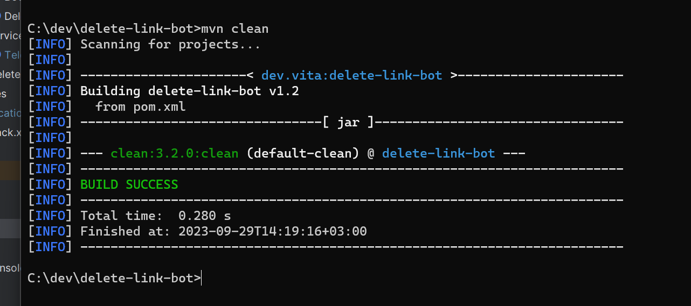
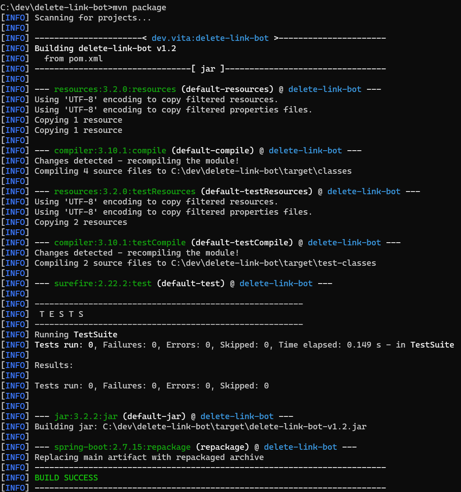

# Delete link telegrambot

This Telegram bot deletes all messages sent by users who are not chat administrators that contain links. 
The URL-Detector library from LinkedIn is used to recognize messages with links.

Link to library: [URL-Detector](https://github.com/linkedin/URL-Detector/)

_Note from library: Keep in mind that for security purposes, it's better to overdetect urls and check more against blacklists than to not detect a url that was submitted. As such, some things that we detect might not be urls but somewhat look like urls. Also, instead of complying with RFC 3986 (http://www.ietf.org/rfc/rfc3986.txt), we try to detect based on browser behavior, optimizing detection for urls that are visitable through the address bar of Chrome, Firefox, Internet Explorer, and Safari._

_Note to bot: Users can't send code snippets because dot-notation will be detected as url  

Following texts will be detected as valid url and messages containing them will be deleted:
* '''http://www.gilliman.com'''
* ''"http://www.gilliman.com"''
* @@http://www.gilliman.com"''
* www.google.com
* google.com
* dot.com
* dfsdfhttps://xn--90aivcdt6dxbc.xn--p1ai/fsdf
* https://xn--90aivcdt6dxbc.xn--p1ai/fsdf
* http://www.foufos.gr
* https://www.foufos.gr
* http://foufos.gr
* http://www.foufos.gr/kino
* http://werer.gr
* www.foufos.gr
* ####www.mp3.com
* www.t.co
* http://t.co
* http://www.t.co
* https://www.t.co
* www.aa.com
* http://aa.com
* http://www.aa.com
* https://www.aa.com
* www.foufos
* www.foufos-.gr
* www.-foufos.gr
* foufos.gr
* http://www.foufos
* www.mp3#.com
* 23422.com
* 111111.by
* fsdfsdfsdfsdf434234.net
* 0--09-0909-0.comcwWERGWDFWEF3323###4
* ------.com
* www.mp3.com
* jooom.molod.kol
* разъяснены новые на сайте объясняем.рф

## How to work
__1 This version of the bot is for running using your own Telegram bot data, namely the name and token.__

__2 This is not release. You need to make jar file from this source code__

__3 To do this you need maven installed on your pc. You can use for example [instruction](https://byanr.com/installation-guides/maven-windows-11/)__

__4 Run in the project root directory command ```mvn clean``` and after ```mvn package```__
```bash
    mvn clean
```


```bash
    mvn package
```


__5 Then in *\<ROOT DIRECTORY\>/target* run command:__
```bash
java -jar delete-link-bot-v1.2.jar --bot.name=<YOUR BOT NAME> --bot.token=<YOUR BOT TOKEN>
```
__after success you will see this result__


__6 Your bot name and token you get from botfathe in telegram__


__7 Bot Logs you can find here: \<YOUR PC ROOT DIRECTORY\>\var\log\delete-link-bot__


__8 After bot successfully had started you must add bot to ypur group and give him admin with permission to delete messages__